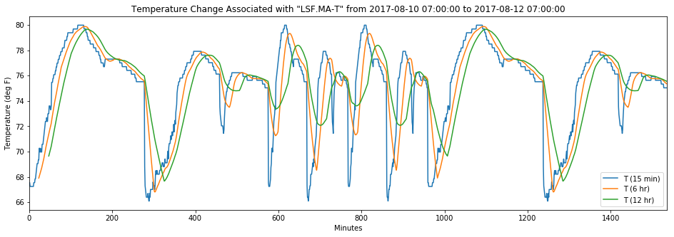

```python
class TemperatureAPI():
    
    def __init__(self, db_host, db_name, db_user, db_passwd):
        '''
        Initialize parameters for connecting to MSSQL database at AWS.
        ---
        
        :type df_host: str
        :param df_host: url/IP of database host
        
        :type db_host: str
        :param db_name: name of database
        
        :type db_user: str
        :param db_user: user name
        
        :type db_passwd: str
        :param db_passwd: user password

        '''
        self.db_host = db_host
        self.db_name = db_name
        self.db_user = db_user
        self.db_passwd = db_passwd
        self.connection_string = 'Driver={ODBC Driver 13 for SQL Server};Server=' + db_host + ';Database=' + db_name + ';UID=' + db_user + ';PWD=' + db_password + ';'
        self.db, self.df, self.start, self.end = None, None, None, None
        
    def _buildConnecion(self):
        '''
        Establish connection to the remote MSSQL database at AWS RDS.
        '''
        try:
            self.db = pyodbc.connect(connectString = self.connection_string)
            print('connected successfully!')
        except:
            print sys.exc_info()
            
    def queryTemperature(self, start, end):
        '''
        Query temperature values from certain start and end date time.
        ---
        
        :type start, end: str
        :param start, end: e.g. 2017-08-10 07:00:00      
        '''
        # establish database connection         
        self._buildConnecion()
        
        query_str = "SELECT * FROM HistoryNumericTrendRecord WHERE HISTORY_ID LIKE '%/Gowen/BacnetNetwork_1201_GOWEN$2eLSF$2eMA$2dT%' AND TIMESTAMP BETWEEN "\
        + "\'" + start + "\'" + " AND " + "\'" + end + "\'" + ";";
        
        # query data with Pandas
        df = pd.read_sql(query_str, self.db)
        
        df.columns = ['ID', 'TIMESTAMP', 'TRENDFLAGS', 'STATUS', 'VALUE', 
              'HISTORY_ID', 'TRENDFLAGS_TAG', 'STATUS_TAG']
        
        self.df = df
        self.start, self.end = start, end
            
    def linePlot(self):
        '''
        Calculate rolling mean for idicating increasing/decreasing trend;
        Generate line plot for illustrating temperature flucuations
        '''
        df = self.df
        
        # calculate rolling mean
        df['6hr'] = df['VALUE'].rolling(window = 24).mean()
        df['12hr'] = df['VALUE'].rolling(window = 48).mean()
        
        
        # plot temperature data and the corresponding rolling mean
        ax = df[['VALUE', '6hr', '12hr']].plot(figsize = (16, 5))

        title = 'Temperature Change Associated with \"LSF.MA-T\" from ' + self.start + ' to ' + self.end
        ax.set_title(title)

        # Set the x-axis label
        ax.set_xlabel("Minutes")

        # Set the y-axis label
        ax.set_ylabel("Temperature (deg F)")

        ax.legend(["T (15 min)", "T (6 hr)", "T (12 hr)"]);
        
    
    def saveQuery(self, file_path):
        '''
        Save query result as csv file to specified path.
        ---
        
        :type file_path: str
        :param: e.g. './file_to_save.csv'
        '''
        self.df.to_csv(file_path)
        print('qurey result has been saved to {}'.format(file_path))
```

### use demo:

```python
# the following code has been tested only on Python2.7, please consider using the same python environment

# import dependent libraries
import sys
import pypyodbc
import pandas as pd

# connection configurations
db_host = 'url'
db_name = 'xxx'
db_user = 'xxx'
db_password = 'xxx'

# initialization
test = TemperatureAPI(db_host, db_name, db_user, db_password)

# query
test.queryTemperature('2017-08-10 07:00:00', '2017-08-12 07:00:00')

# get results with pandas dataframe format
test_df = test.df

# save results
test.saveQuery('./test.csv')

# plot
test.linePlot()
```

expected line plot:


